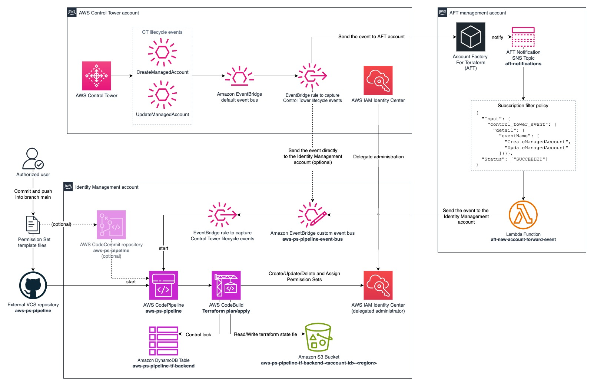

# AWS Permission Set Pipeline

This solution enables you to dynamically manage [AWS IAM Identity Center](https://docs.aws.amazon.com/singlesignon/latest/userguide/what-is.html) Permission Sets through infrastructure as code using a CI/CD pipeline built with native AWS services. Furthermore, it enables a seamless integration of the Permission Set assignment mechanism with the [AWS Control Tower](https://docs.aws.amazon.com/controltower/latest/userguide/what-is-control-tower.html) lifecycle events or [Account Factory for Terraform](https://docs.aws.amazon.com/controltower/latest/userguide/aft-overview.html) (AFT) environment, providing dynamic identity configurations for both new and existing AWS accounts.

Amazon EventBridge rules monitor AWS account creation and update, ensuring your identity configurations remain synchronized with your organizational structure. After creating/updating accounts in Control Tower or AFT, the pipeline will be triggered to evaluate a set of JSON files with Permission Set definitions and assignment rules, to then apply and synchronize the settings across all accounts.

## Architecture



### Control Tower Events Flow

The solution begins with the integration of events coming from either Control Tower or AFT. The choice between one or the other is made at the implementation time through variable definition. Regardless of which method is used, whenever an account is created or updated, the pipeline triggers to reconcile the policies stored in the Permission Sets management repository.

**AWS Control Tower generates lifecycle events:**

- CreateManagedAccount - When a new account is created
- UpdateManagedAccount - When an existing account is updated

### Event Routing

EventBridge serves as the central event processing service, capturing events generated in the AWS Control Tower account. When events occur, EventBridge intelligently routes them to appropriate targets based on the event type classification. Control Tower lifecycle events follow distinct routing patterns if the Account Factory for Terraform is defined as event source, being handle by AFT management account. This event-driven architecture enables automated responses to organizational changes without manual intervention.

### AFT Integration Process

When AFT integration events reach the AFT management account, they automatically trigger multiple downstream processes intrinsic to the AFT. Once the AFT account customization workflow has been completed, it publishes a message into the dedicated aft-notifications SNS topic, that triggers the aft-new-account-forward-event Lambda function implemented by the solution. This Lambda send the event to the solution account, where it will be used to start the pipeline.

### Infrastructure as Code Pipeline

The solution pipeline operates as a fully automated deployment mechanism. The AWS CodePipeline service continuously monitors the repository for changes. Upon detecting new commits, it automatically initiates the deployment workflow and initiates a sequential process that includes validation and execution phases. The system runs Terraform plan operations to identify proposed changes, followed by Terraform apply commands to implement those changes in the AWS environment. Notably, the pipeline run without manual approval gates, enabling rapid deployment of infrastructure changes while maintaining auditability through pipeline logs and Terraform state files.

The pipeline leverages AWS CodeBuild to run Terraform operations in a controlled environment with appropriate permissions. Through this infrastructure-as-code approach, the pipeline can perform comprehensive permission management operations including creating new Permission Sets, updating existing Permission Sets, removing deprecated Permission Sets, and managing the assignment of these permissions across accounts and groups within the AWS organization.

To maintain infrastructure consistency and prevent conflicting changes, the solution implements the Terraform backend state management system using an Amazon S3 bucket and dedicated Amazon DynamoDB table. This provides persistent storage location for Terraform state files and state locking mechanisms to prevent concurrent modifications to the same resources.

The main Terraform code relies on the oficial AWS [permission-sets](https://registry.terraform.io/modules/aws-ia/permission-sets/aws/latest) Terraform module, that can dynamically create, update, delete and assign Permission Sets in Identity Center, based on the JSON files.

### Source Control Management

The Permission Set templates (JSON files) reside in an external version control system, such as GitHub, providing a centralized repository for identity management configurations. This approach establishes a single source of truth for permission definitions while enabling collaborative development through standard code review practices. Authorized users can commit changes to these templates following organizational change management processes. These commits serve as the primary trigger for the automated deployment pipeline, initiating the infrastructure update process.

Example about how configure the Permission Sets using the JSON file on the repo:

JSON file with a sample Permission Set:

```json
{
  "Name": "ps-billing", 
  "Comment": "Sample permission set for billing access", 
  "Description": "Billing access in AWS", 
  "SessionDuration": "PT4H", 
  "ManagedPolicies": [ 
    "arn:aws:iam::aws:policy/job-function/Billing",
    "arn:aws:iam::aws:policy/job-function/SupportUser",
    "arn:aws:iam::aws:policy/AWSSupportAccess",
    "arn:aws:iam::aws:policy/job-function/ViewOnlyAccess"
  ],
  "CustomerPolicies": [], 
  "CustomPolicy": {}, 
  "PermissionBoundary": {  
    "ManagedPolicy": "",
    "CustomerPolicy": ""
  },
  "Assignments": [ 
    {
      "all_accounts": true, 
      "principal": "G_BILLING_USERS", 
      "type": "GROUP", 
      "account_id": [], 
      "account_ou": [], 
      "account_tag": [] 
    }
  ]
}
```

See the JSON schema in the module [documentation](https://registry.terraform.io/modules/aws-ia/permission-sets/aws/latest#json-file-templates).

---

## Prerequisites

- A multi-account environment with AWS Control Tower and AWS Organizations already set up.
- Optionally you can use AFT in conjunction with AWS Control Tower.
- Prepare the VCS repo that will handle the main code. You can see a sample in the solution [repository](https://github.com/aws-samples/sample-terraform-aws-permission-sets-pipeline/tree/main/samples/basic).
- Prepare an IAM Identity Center delegated administrator AWS account to receive the solution. See more in [AWS IAM Identity Center delegated administration](https://docs.aws.amazon.com/singlesignon/latest/userguide/delegated-admin.html).

## Limitations

The pipeline uses AWS native resources and Terraform Open-Source version, it's not prepared to make calls to third-party ecosystems, such as Terraform Cloud.

## Security

See [CONTRIBUTING](CONTRIBUTING.md#security-issue-notifications) for more information.

## License

This library is licensed under the MIT-0 License. See the LICENSE file.

<!-- BEGIN_TF_DOCS -->
## Requirements

| Name | Version |
|------|---------|
| terraform | >=1.5 |
| aws | ~>5.0 |

## Providers

| Name | Version |
|------|---------|
| aws | ~>5.0 |
| aws.event-source-account | ~>5.0 |

## Modules

No modules.

## Resources

| Name | Type |
|------|------|
| [aws_cloudwatch_event_bus.pipeline](https://registry.terraform.io/providers/hashicorp/aws/latest/docs/resources/cloudwatch_event_bus) | resource |
| [aws_cloudwatch_event_permission.pipeline](https://registry.terraform.io/providers/hashicorp/aws/latest/docs/resources/cloudwatch_event_permission) | resource |
| [aws_cloudwatch_event_rule.ct_events](https://registry.terraform.io/providers/hashicorp/aws/latest/docs/resources/cloudwatch_event_rule) | resource |
| [aws_cloudwatch_event_rule.pipeline](https://registry.terraform.io/providers/hashicorp/aws/latest/docs/resources/cloudwatch_event_rule) | resource |
| [aws_cloudwatch_event_rule.this](https://registry.terraform.io/providers/hashicorp/aws/latest/docs/resources/cloudwatch_event_rule) | resource |
| [aws_cloudwatch_event_target.ct_events](https://registry.terraform.io/providers/hashicorp/aws/latest/docs/resources/cloudwatch_event_target) | resource |
| [aws_cloudwatch_event_target.pipeline](https://registry.terraform.io/providers/hashicorp/aws/latest/docs/resources/cloudwatch_event_target) | resource |
| [aws_cloudwatch_event_target.this](https://registry.terraform.io/providers/hashicorp/aws/latest/docs/resources/cloudwatch_event_target) | resource |
| [aws_cloudwatch_log_group.this](https://registry.terraform.io/providers/hashicorp/aws/latest/docs/resources/cloudwatch_log_group) | resource |
| [aws_codebuild_project.this](https://registry.terraform.io/providers/hashicorp/aws/latest/docs/resources/codebuild_project) | resource |
| [aws_codecommit_repository.pipeline](https://registry.terraform.io/providers/hashicorp/aws/latest/docs/resources/codecommit_repository) | resource |
| [aws_codeconnections_connection.github](https://registry.terraform.io/providers/hashicorp/aws/latest/docs/resources/codeconnections_connection) | resource |
| [aws_codeconnections_connection.githubenterprise](https://registry.terraform.io/providers/hashicorp/aws/latest/docs/resources/codeconnections_connection) | resource |
| [aws_codeconnections_host.githubenterprise](https://registry.terraform.io/providers/hashicorp/aws/latest/docs/resources/codeconnections_host) | resource |
| [aws_codepipeline.this](https://registry.terraform.io/providers/hashicorp/aws/latest/docs/resources/codepipeline) | resource |
| [aws_dynamodb_table.tf_backend](https://registry.terraform.io/providers/hashicorp/aws/latest/docs/resources/dynamodb_table) | resource |
| [aws_iam_role.codebuild](https://registry.terraform.io/providers/hashicorp/aws/latest/docs/resources/iam_role) | resource |
| [aws_iam_role.codepipeline](https://registry.terraform.io/providers/hashicorp/aws/latest/docs/resources/iam_role) | resource |
| [aws_iam_role.ct_events](https://registry.terraform.io/providers/hashicorp/aws/latest/docs/resources/iam_role) | resource |
| [aws_iam_role.lambda](https://registry.terraform.io/providers/hashicorp/aws/latest/docs/resources/iam_role) | resource |
| [aws_iam_role.start_pipeline](https://registry.terraform.io/providers/hashicorp/aws/latest/docs/resources/iam_role) | resource |
| [aws_iam_role_policy.codebuild_identity_center_policy](https://registry.terraform.io/providers/hashicorp/aws/latest/docs/resources/iam_role_policy) | resource |
| [aws_iam_role_policy.codebuild_policy](https://registry.terraform.io/providers/hashicorp/aws/latest/docs/resources/iam_role_policy) | resource |
| [aws_iam_role_policy.codepipeline_policy](https://registry.terraform.io/providers/hashicorp/aws/latest/docs/resources/iam_role_policy) | resource |
| [aws_iam_role_policy.ct_events](https://registry.terraform.io/providers/hashicorp/aws/latest/docs/resources/iam_role_policy) | resource |
| [aws_iam_role_policy.lambda_policy](https://registry.terraform.io/providers/hashicorp/aws/latest/docs/resources/iam_role_policy) | resource |
| [aws_iam_role_policy.start_pipeline](https://registry.terraform.io/providers/hashicorp/aws/latest/docs/resources/iam_role_policy) | resource |
| [aws_kms_alias.cmk_alias](https://registry.terraform.io/providers/hashicorp/aws/latest/docs/resources/kms_alias) | resource |
| [aws_kms_key.cmk](https://registry.terraform.io/providers/hashicorp/aws/latest/docs/resources/kms_key) | resource |
| [aws_lambda_function.aft_new_account_event_forwarder](https://registry.terraform.io/providers/hashicorp/aws/latest/docs/resources/lambda_function) | resource |
| [aws_lambda_permission.aft_new_account_event_forwarder](https://registry.terraform.io/providers/hashicorp/aws/latest/docs/resources/lambda_permission) | resource |
| [aws_s3_bucket.pipeline](https://registry.terraform.io/providers/hashicorp/aws/latest/docs/resources/s3_bucket) | resource |
| [aws_s3_bucket.tf_backend](https://registry.terraform.io/providers/hashicorp/aws/latest/docs/resources/s3_bucket) | resource |
| [aws_s3_bucket_public_access_block.pipeline](https://registry.terraform.io/providers/hashicorp/aws/latest/docs/resources/s3_bucket_public_access_block) | resource |
| [aws_s3_bucket_public_access_block.tf_backend](https://registry.terraform.io/providers/hashicorp/aws/latest/docs/resources/s3_bucket_public_access_block) | resource |
| [aws_s3_bucket_server_side_encryption_configuration.pipeline](https://registry.terraform.io/providers/hashicorp/aws/latest/docs/resources/s3_bucket_server_side_encryption_configuration) | resource |
| [aws_s3_bucket_server_side_encryption_configuration.tf_backend_encryption](https://registry.terraform.io/providers/hashicorp/aws/latest/docs/resources/s3_bucket_server_side_encryption_configuration) | resource |
| [aws_s3_bucket_versioning.pipeline](https://registry.terraform.io/providers/hashicorp/aws/latest/docs/resources/s3_bucket_versioning) | resource |
| [aws_s3_bucket_versioning.tf_backend](https://registry.terraform.io/providers/hashicorp/aws/latest/docs/resources/s3_bucket_versioning) | resource |
| [aws_sns_topic_subscription.aft_new_account_event_forwarder](https://registry.terraform.io/providers/hashicorp/aws/latest/docs/resources/sns_topic_subscription) | resource |
| [archive_file.aft_new_account_event_forwarder](https://registry.terraform.io/providers/hashicorp/archive/latest/docs/data-sources/file) | data source |
| [aws_caller_identity.current](https://registry.terraform.io/providers/hashicorp/aws/latest/docs/data-sources/caller_identity) | data source |
| [aws_iam_policy_document.cmk_policy](https://registry.terraform.io/providers/hashicorp/aws/latest/docs/data-sources/iam_policy_document) | data source |
| [aws_organizations_organization.org](https://registry.terraform.io/providers/hashicorp/aws/latest/docs/data-sources/organizations_organization) | data source |
| [aws_region.current](https://registry.terraform.io/providers/hashicorp/aws/latest/docs/data-sources/region) | data source |
| [aws_ssm_parameter.aft_management_account_id](https://registry.terraform.io/providers/hashicorp/aws/latest/docs/data-sources/ssm_parameter) | data source |
| [aws_ssm_parameter.aft_sns_notification_topic_arn](https://registry.terraform.io/providers/hashicorp/aws/latest/docs/data-sources/ssm_parameter) | data source |
| [aws_ssoadmin_instances.sso](https://registry.terraform.io/providers/hashicorp/aws/latest/docs/data-sources/ssoadmin_instances) | data source |
| [local_file.buildspec](https://registry.terraform.io/providers/hashicorp/local/latest/docs/data-sources/file) | data source |

## Inputs

| Name | Description | Type | Default | Required |
|------|-------------|------|---------|:--------:|
| account\_lifecycle\_events\_source | Define from where to capture account lifecycle events: AFT, Control Tower (CT) or None. Based on this choice, you also must change the provider for the source account (aws.event-source-account). For exemple:    - For AFT as the source account, inform the provider with access to AFT management account: ```providers = { aws.event-source-account = aws.aft-management }``` - For CT as the source account, inform the provider with access to CT management account: ```providers = { aws.event-source-account = aws.org-management }``` - If you don't want to use account lifecycle events to trigger the pipeline, select None and inform the aws default provider: ```providers = { aws.event-source-account = aws }``` | `string` | `"None"` | no |
| branch\_name | Repository main branch name. | `string` | `"main"` | no |
| enable\_vpc\_config | Enable VPC configuration for CodeBuild project and CodeConnections Host. | `bool` | `false` | no |
| github\_enterprise\_url | GitHub enterprise URL, if GitHub Enterprise is being used. (inform only if vcs\_provider = githubenterprise) | `string` | `"null"` | no |
| repository\_name | VCS repository name. For external VCS, inform the full repository path (e.g. GitHubOrganization/repository-name). | `string` | `"aws-ps-pipeline"` | no |
| solution\_name | Solution name. | `string` | `"aws-ps-pipeline"` | no |
| tags | n/a | `map(string)` | `{}` | no |
| vcs\_provider | Customer VCS Provider - valid inputs are codecommit, github, or githubenterprise | `string` | `"github"` | no |
| vpc\_config | VPC configuration to set to CodeBuild project and CodeConnections Host. (enable\_vpc\_config must be true) | ```object({ vpc_id = string subnets = list(string) security_groups = list(string) })``` | ```{ "security_groups": [], "subnets": [], "vpc_id": "" }``` | no |

## Outputs

No outputs.
<!-- END_TF_DOCS -->